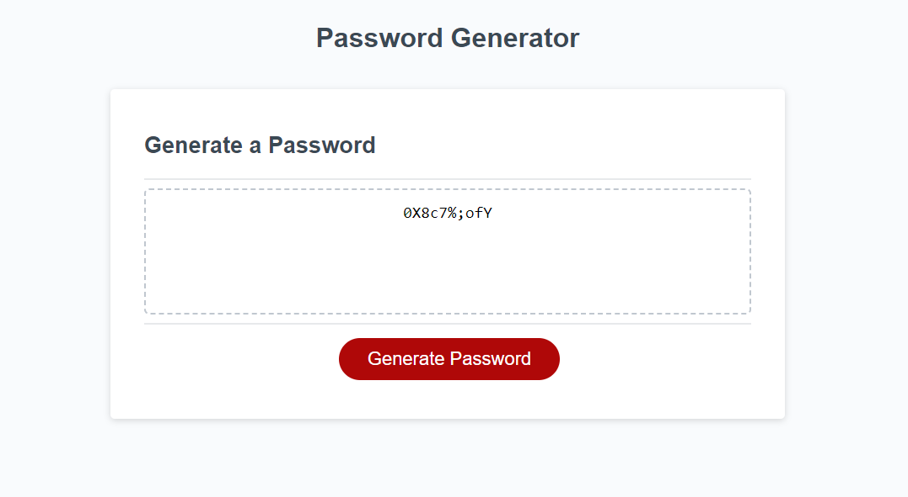

# PasswordGenerator-3

I created a password generator with JavaScript. CSS, and HTML. The user is able to create a random password with special characters, numbers, upper case and lower case letters. The length has to be from 10 to 130 characters long. I was able to use several different variables, functions and for loops to create this. 

# live site: 

# Screenshot 
 

# Acceptance Criteria

    GIVEN I need a new, secure password
	WHEN I click the button to generate a password
	THEN I am presented with a series of prompts for password criteria
	WHEN prompted for password criteria
	THEN I select which criteria to include in the password
	WHEN prompted for the length of the password
	THEN I choose a length of at least 10 characters and no more than 130 characters
	WHEN asked for character types to include in the password
	THEN I confirm whether or not to include lowercase, uppercase, numeric, and/or special characters
	WHEN I answer each prompt
	THEN my input should be validated and at least one character type should be selected
	WHEN all prompts are answered
	THEN a password is generated that matches the selected criteria
	WHEN the password is generated
	THEN the password is either displayed in an alert or written to the page